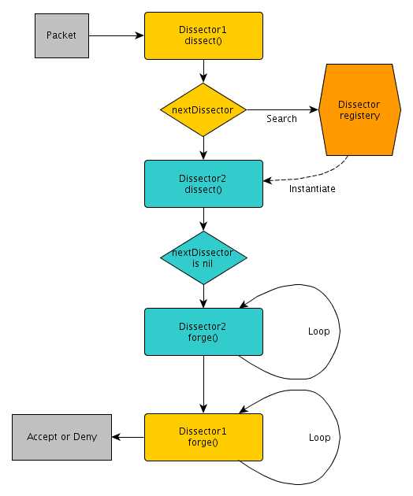

.. This Source Code Form is subject to the terms of the Mozilla Public
.. License, v. 2.0. If a copy of the MPL was not distributed with this
.. file, You can obtain one at http://mozilla.org/MPL/2.0/.

Haka architecture
=================

General architecture
--------------------

This graphic present a high level view of the Haka architecture.

.. image:: arch.png
    :align: center

Flow
----

The flows that go on the network and through Haka are named using the following conventions:

.. image:: flow.png
    :align: center

* *Up*/*Down*: Direction of the flow from the client to the server.
* *In*/*Out*: Direction of the flow regarding the Haka router.

Packet capture and filtering
----------------------------

Haka will call the capture module and wait for an incoming packet. Once a
packet is received, it is filtered by calling the dissectors and the rules
setup by the user in the configuration file. At some point, one dissector
will `accept/drop` the packet to make it `continue/stop` its
journey on the network.

.. image:: capture.png
    :align: center

Packet dissectors
-----------------

Haka threads will wait for the capture module to receive a packet. When one
is available, the module will pass it to the correct dissector.

The next image shows the work-flow of a received packet.

The same process is also true for the comunication between one dissector and
the next dissector. By calling the *receive* function, the ownership is given
to the called dissector. This means that the packet will never be send on the
network unless this dissector accept the packet.

Flow and context
----------------

When a flow need to be created (for TCP or UDP for instance), a context need
to be created by the dissector that do the transition from state-less to
state-full.

.. image:: flowdiss.png
    :align: center
